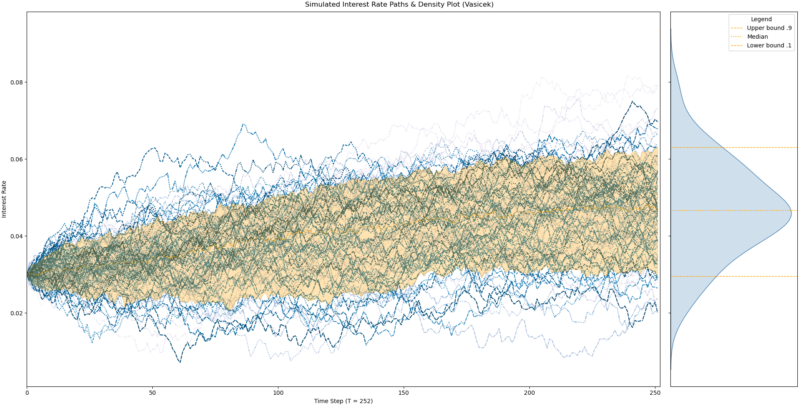
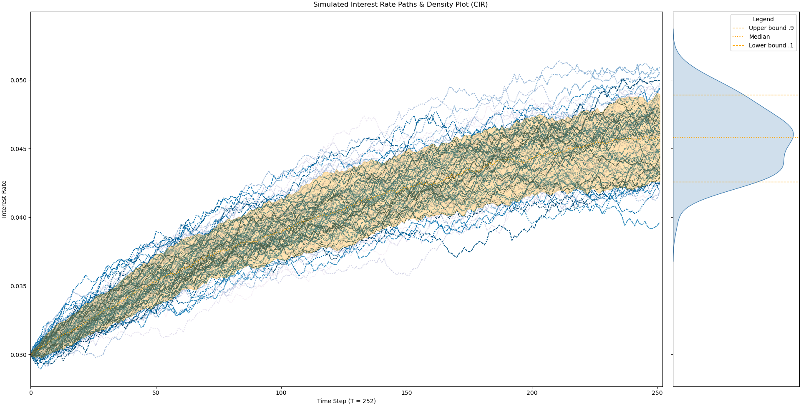

# Interest Rate Forecasting


Work with historical Euribor data and forecast interest rates utilizing stochastic models and Monte Carlo simulations.

## Features

- Fetch historical Euribor data from 1999 onwards by maturity in standardized format
- Initialize discrete Vasicek and Cox-Ingersoll-Ross models 
- Simulate and visualize interest rate paths with Monte Carlo simulations
## Requirements

NumPy, pandas, Matplotlib and seaborn are required:

```python
pip install numpy
pip install pandas
pip install matplotlib
pip install seaborn
```

The Anaconda distribution for Python is recommended, which includes all the requirements:

https://www.anaconda.com/download
## Usage

Copy the following files from src to your working directory:
- `interest_rates.py` for fetching historical data
- `ir_models.py` for initializing interest rate models
- `monte_carlo.py` for simulating and visualizing the models
## Example

This example shows how to fetch historical Euribor data, initialize the interest rate models and simulate them with Monte Carlo.

```python
from interest_rates import Euribor
from ir_models import VasicekModel, CIRModel
from monte_carlo import MonteCarlo
```
### Fetching Euribor Data

Historical Euribor data is available for the following maturities:
- 1 week
- 1 month
- 3 months
- 6 months
- 12 months

There are four methods for fetching the data:

- `get_current()`
- `get_daily(start: str, end: str)`
- `get_monthly(start: str, end: str)`
- `get_yearly(start: str, end: str)`

The `get_current()` method returns the most recent rate of the previous business day as a float, whereas the others return date indexed DataFrames for the user specified date ranges:

```python
# Monthly Euribor rates from January 2024 to July 2025
r = Euribor(maturity="3 months")
monthly = r.get_monthly(start="2024/01", end="2025/07")
print(monthly)
```

| Date       | Euribor (3 months) |
| :--------- | -----------------: |
| 2024-01-01 |            0.03905 |
| 2024-02-01 |            0.03884 |
| 2024-03-01 |            0.03938 |
| 2024-04-01 |            0.03883 |
| 2024-05-01 |            0.03853 |
| 2024-06-03 |            0.03782 |
| 2024-07-01 |            0.03709 |
| 2024-08-01 |            0.03638 |
| 2024-09-02 |            0.03469 |
| 2024-10-01 |            0.03252 |
| 2024-11-01 |            0.03085 |
| 2024-12-02 |            0.02924 |
| 2025-01-01 |            0.02736 |
| 2025-02-03 |            0.02562 |
| 2025-03-03 |            0.02464 |
| 2025-04-01 |            0.02324 |
| 2025-05-01 |            0.02142 |
| 2025-06-02 |            0.01979 |
| 2025-07-01 |            0.01961 |
### Initializing Interest Rate Models

The package contains two stochastic models for forecasting interest rates:
- Vasicek Model
- Cox-Ingersoll-Ross Model

For theoretical background on the models, see:<br>
https://en.wikipedia.org/wiki/Vasicek_model<br>
https://en.wikipedia.org/wiki/Cox%E2%80%93Ingersoll%E2%80%93Ross_model

Both models are initialized with the following parameters:
- theta: the mean reversion speed
- mu: the long-term mean interest rate
- sigma: interest rate volatility
- r0: the initial/current interest rate
- T: time horizon in years (default 1)
- N: the number of time steps to simulate (default 252, the amount of business days in a year)

Example: Current interest rate is 0.03, long-term mean is 0.05, volatility is 0.02 and mean reversion speed is 1.5:

```python
# Using the same parameters for both Vasicek and CIR models
mean_reversion_speed = 1.5
long_term_mean = 0.05
volatility = 0.02
initial_rate = 0.03

# Use default T = 1 and N = 252 for both models
vasicek = VasicekModel(theta=mean_reversion_speed,
                       mu=long_term_mean,
                       sigma=volatility,
                       r0=initial_rate)

cir = CIRModel(theta=mean_reversion_speed,
               mu=long_term_mean,
               sigma=volatility,
               r0=initial_rate)
```
### Simulating Interest Rate Paths with Monte Carlo

> [!IMPORTANT]
> The example below is a result of a random process.

Simulate the Vasicek Model with 100 Monte Carlo simulation runs:

```python
# Monte Carlo simulation with 100 simulation runs
vasicek_mc = MonteCarlo(model=vasicek,
                        number_of_simulations=100)

cir_mc = MonteCarlo(model=cir,
                    number_of_simulations=100)
```

The `results()` method returns a DataFrame with each column representing a single simulation run. The `visualize()` method shows the results alongside with 0.9 and 0.1 confidence bounds and the median:

```python
vasicek_mc.visualize()
cir_mc.visualize()
```





The `stats()` method shows summary statistic of the simulations:

```python
print(vasicek_mc.stats())
```

|                            | Results for 100 simulations   |
|:---------------------------|:------------------------------|
| Model                      | Vasicek                       |
| Initial Interest Rate (r0) | 0.03                          |
| Long-Term Mean (mu)        | 0.05                          |
| 90% quantile at T = 252    | 0.06308053381856575           |
| Median at T = 252          | 0.04662813286319578           |
| 10% quantile at T = 252    | 0.029547065622756635          |

```python
print(cir_mc.stats())
```

|                            | Results for 100 simulations   |
|:---------------------------|:------------------------------|
| Model                      | CIR                           |
| Initial Interest Rate (r0) | 0.03                          |
| Long-Term Mean (mu)        | 0.05                          |
| 90% quantile at T = 252    | 0.04893487926964539           |
| Median at T = 252          | 0.045827135163105465          |
| 10% quantile at T = 252    | 0.04260202605388624           |